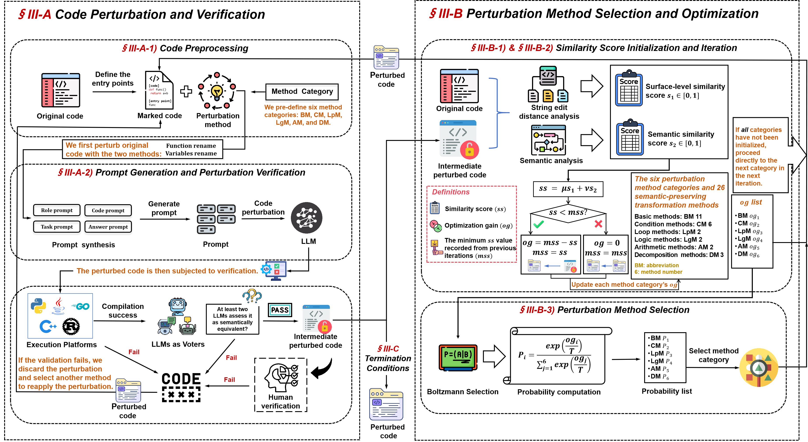

# CodeMorph

CodeMorph is a tool that uses semantic-preserving transformations to perturb code, effectively mitigating data leakage in LLM evaluation datasets. It optimizes combinations of perturbation methods through a genetic algorithm to enhance the effectiveness of the transformations.

## Workflow


## Download and Installation

### JPlag
Ensure that [JPlag](https://github.com/jplag/JPlag) is installed in the CODEMORPH directory, as it will also install other necessary dependencies, such as the g++ compiler.

### Dependencies
   ```bash
   pip install -r requirements.txt
   ```

## API Setup
Configure the *LLM_LIST* in **perturbation.py** with the corresponding model, API key, and base URL required to create an OpenAI client:

   ```python
   LLM_LIST = {
       'perturbation_llm': ['model', 'api_key', 'base_url'],
       'voter_llm_1': ['model', 'api_key', 'base_url'],
       'voter_llm_2': ['model', 'api_key', 'base_url'],
       'voter_llm_3': ['model', 'api_key', 'base_url'],
   }
   ```

Each entry should include the specific model name, API key, and base URL for each LLM instance you are configuring.

## Preparing the Code File
Prepare a JSONL file containing the code to be perturbed, with each line formatted as follows:

   ```json
   {"task_id": "task_1", "code": "original code", "entry_point": "your entry point"}
   ```

## Running the Tool
   ```bash
   python -m CodeMorph.codemorph \
       --lang python \  # required parameter; choose from [python, c, cpp, rust, java, go]
       --file ./example.jsonl \  # required parameter; a JSONL file
       --mi 15 \  # maximum iterations (default: 15)
       --st 0.2 \  # similarity threshold (default: 0.2)
       --temper 2  # temperature for Boltzmann selection (default: 2)
   ```

This command runs CodeMorph with the specified language and code file, setting the maximum number of iterations (`--mi`), similarity threshold (`--st`), and temperature for selection (`--temper`).

To adjust the weights of $s_1$ and $s_2$, modify the `compose_similarity_score` function in **similarity_computation.py**.